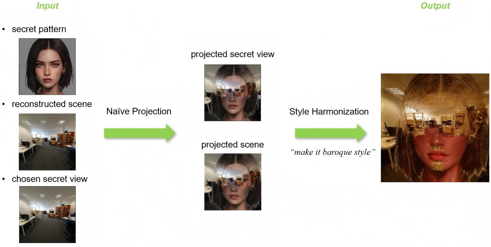
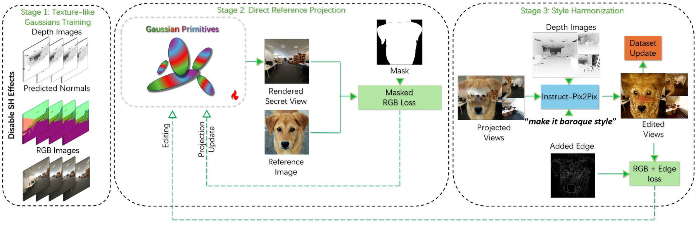
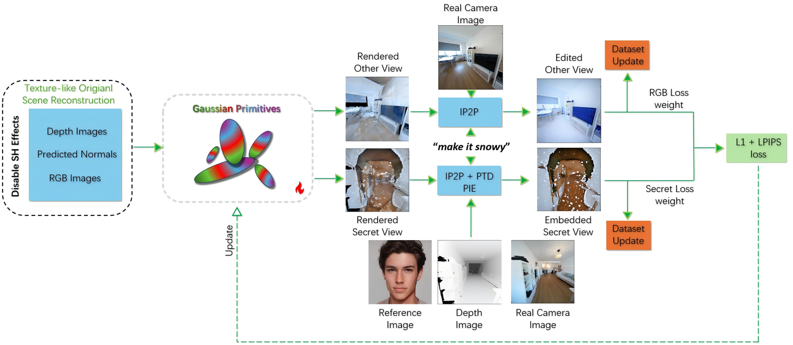
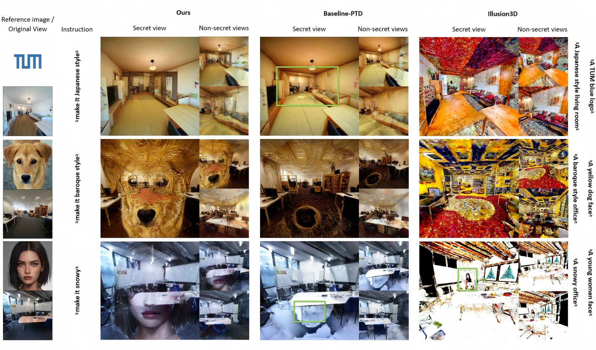
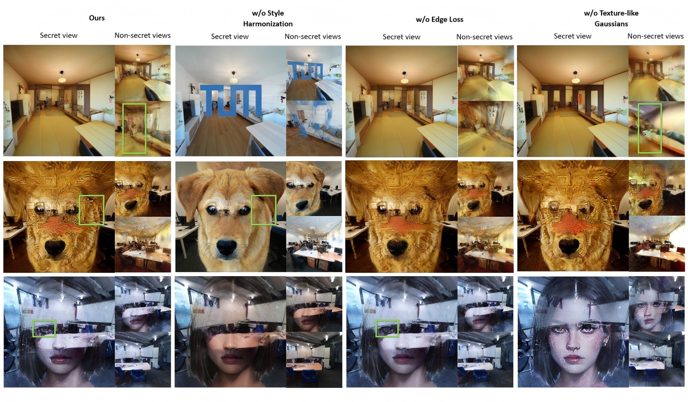

# Anamorphic Scene: Embed Secret Messages in 3D Textures

**[Qianru Li](https://github.com/Pangolin112), [Lukas Höllein](https://lukashoel.github.io/)**
Technical University of Munich · Guided Research, 2025

<p align="center">
  
</p>

> Given a user-specified **secret pattern**, an **embedding viewpoint**, and a **text editing instruction**, Anamorphic Scene turns a reconstructed indoor scene into a style-harmonized 3D scene with an anamorphic illusion embedded in it. The secret is legible from the chosen viewpoint and dissolves into ordinary scene texture from every other view.

---

## Overview

Visual encryptions such as visual anagrams and anamorphic illusions hide messages that become legible only from the right viewpoint. Anamorphic Scene is a method for generating such viewpoint-dependent illusions in **realistic 3D indoor environments**. Unlike prior illusion work that targets 2D images or simple 3D shapes, our approach operates directly on reconstructed 3D scenes.

At its core, Anamorphic Scene projects a secret pattern into a target view of a 3D Gaussian Splatting (3DGS) scene and distills 2D priors from a pretrained diffusion model to synthesize consistent 3D content that realizes the illusion. To balance recognizability at the secret view with realism elsewhere, a multimodal illusion-conditioning module and a multi-stage optimization strategy jointly guide appearance and geometry, so that the secret is revealed from the designated viewpoint while other views stay stable and natural. Experiments on ScanNet++ show convincing 3D illusions with preserved scene fidelity across non-target views.

**Contributions**

- To our knowledge, the first efficient pipeline for generating anamorphic illusions in *realistic* 3D indoor scenes.
- A multimodal illusion-conditioning module and a multi-stage optimization strategy that jointly guide appearance and geometry, revealing viewpoint-dependent secrets while keeping non-target views stable and natural.
- Fully customizable 3D scene editing driven by the user's secret pattern, chosen reveal viewpoint, and textual instruction.

## Method

<p align="center">
  
</p>

The pipeline has three stages. It starts from a texture-like 3DGS reconstruction supervised by depth and normals, then directly projects the secret image into the chosen view, and finally harmonizes the projected secret with the rest of the scene through instruction-based editing.

### Stage 1: Surface-aligned (texture-like) 3D Gaussians

We reconstruct the scene with 3D Gaussian Splatting, following [DN-Splatter](https://github.com/maturk/dn-splatter) to enforce depth and normal cues from the original scene. Spherical-harmonics (SH) view dependence is disabled, so the Gaussians behave like a texture on the scene surfaces rather than overfitting to view-dependent effects. The RGB loss replaces the usual D-SSIM term with LPIPS:

$$\mathcal{L}_{\hat I} = (1-\lambda)\,\mathcal{L}_1 + \lambda\,\mathcal{L}_{\mathrm{LPIPS}}$$

Given ground-truth depth $D$ and normals $\mathbf{N}$, the geometry is supervised by an edge-aware log-L1 depth loss and an L1 normal loss:

$$\mathcal{L}_{\hat D} = g_{\mathrm{rgb}}\,\frac{1}{|\hat D|}\sum \log\bigl(1+\|\hat D - D\|_1\bigr), \qquad g_{\mathrm{rgb}} = \exp(-\nabla I)$$

$$\mathcal{L}_{\hat{\mathbf N}} = \frac{1}{|\hat{\mathbf N}|}\sum \|\hat{\mathbf N} - \mathbf N\|_1$$

### Stage 2: Direct projection of the secret pattern

Given the secret image $I_{\mathrm{sec}}$ and the chosen secret viewpoint $v_{\mathrm{sec}}$, the secret is projected into the scene by optimizing the secret view and the other views simultaneously. Non-secret views keep the stage-1 losses. The secret view adds a masked *fighting loss* between $I_{\mathrm{sec}}$ and the current rendering $\hat I$:

$$\mathcal{L}_{\mathrm{fighting}} = \frac{1}{|\mathcal{M}_{\mathrm{sec}}|}\sum \Bigl(\|\hat I - I_{\mathrm{sec}}\|_1 + \text{M-LPIPS}(\hat I, I_{\mathrm{sec}})\Bigr)$$

where $\mathcal{M}_{\mathrm{sec}}$ is a segmentation mask of the secret image extracted with [SAM 2](https://github.com/facebookresearch/sam2) and M-LPIPS is a masked LPIPS perceptual loss. After projection, the dataset images are replaced by the current renderings, which turns the scene into the embedded representation for stage 3.

### Stage 3: Embedding smoothing through style harmonization

The interference introduced by the direct projection is harmonized with instruction-based editing. Conditioned on the instruction, the current rendering, the ground-truth depth, and the updated RGB image from stage 2, a pretrained [InstructPix2Pix](https://github.com/timothybrooks/instruct-pix2pix) model combined with a depth [ControlNet](https://github.com/lllyasviel/ControlNet) edits the style of the projected scene, in the spirit of [Instruct-GS2GS](https://github.com/cvachha/instruct-gs2gs).

Two ingredients make the secret survive the editing:

- **Trust the first secret edit.** Non-secret views are re-edited and written back to the dataset at every editing iteration, while the secret view is updated only once, in the first iteration. The model overfits to that single edited secret view, which avoids the blurriness of iterative dataset updates, and the non-secret views learn to adapt to it, harmonizing the injection from stage 2.
- **Compositional edge loss.** To sharpen the embedding and preserve the original layout, the secret view is supervised with Sobel edges that combine the secret image's edges and the original secret-view edges:

$$\mathcal{L}_{\mathrm{edge}} = \frac{1}{|\mathcal{M}_{\mathrm{sec}}|}\sum \|\hat{\mathbf E} - \mathbf E_{\mathrm{composition}}\|_1, \qquad \mathbf E_{\mathrm{composition}} = \mathbf E_{\mathrm{sec}} + \mathbf E_{\mathrm{orig}}$$

### Baseline: secret embedding based on phase transfer

Since no prior work targets this task, we also build a two-stage baseline on [Phase-Transfer Diffusion (PTDiffusion)](https://github.com/XiangGao1102/PTDiffusion). It uses the same stage-1 initialization, then regenerates the secret view as an optical-illusion image with PTDiffusion at *every* editing iteration, while non-secret views are updated as in stage 3.

<p align="center">
  
</p>

## Results

All methods are evaluated on 10 ScanNet++ scenes with 5 reference images and 5 prompts each. We report the masked LPIPS between the secret image and the final secret view (M-LPIPS, embedding quality), the mean intersection over union against the original layout (MIoU, layout preservation), and the CLIP score between the instruction and the edited views (CLIP, instruction fidelity).

| Method | M-LPIPS ↓ | MIoU ↑ | CLIP ↑ |
| --- | :---: | :---: | :---: |
| Baseline 1: PTDiffusion-based, two-stage | 0.39 | **48.11** | 22.37 |
| Baseline 2: Illusion3D with depth conditioning | 0.68 | 17.65 | **28.80** |
| Ours w/o editing (stage 3) | **0.05** | 28.43 | 13.15 |
| Ours w/o edge loss | 0.31 | 24.78 | 24.21 |
| Ours w/o texture-like Gaussians | 0.32 | 25.46 | 20.55 |
| **Ours** | 0.30 | 33.70 | 22.26 |

Our method outperforms both baselines on M-LPIPS and, among the full pipelines, gives the best balance between embedding the secret and preserving the scene layout. The gap on MIoU reflects the inherent trade-off between layout preservation and secret embedding: the PTDiffusion baseline preserves layout well precisely because its secret views are blurry and unrecognizable.

### Qualitative comparison

<p align="center">
  
</p>

The PTDiffusion baseline fails to embed detailed secret patterns. Illusion3D cannot take the reference image as input, so its secret views are over-saturated and the pattern is barely recognizable, with no control over its position or scale. Our method embeds the details of the secret image at the correct position and scale while preserving the original layout.

### Ablations

<p align="center">
  
</p>

Directly projecting the secret image without stage 3 yields unnatural rooms that ignore most of the original layout. Removing the edge loss weakens the harmonization between the reference image and the scene structure. Without texture-like Gaussians, vanilla 3DGS produces view-dependent renderings that follow no geometric constraints. The full method produces secret-embedded, visually consistent rooms without these artifacts.

## Repository structure

```
AnamorphicScene/
├── config/config.yaml           # hyper-parameters for stages 2-3: prompts, secret view, loss weights, editing schedule
├── dn_splatter/                 # main method, a nerfstudio plugin built on DN-Splatter
│   ├── dn_config.py             # registers the `dn-splatter` method; per-stage iteration counts
│   ├── dn_pipeline.py           # three-stage training logic (secret projection, IP2P editing, edge loss) and evaluation metrics
│   ├── dn_model.py              # Gaussian model with depth/normal regularization and L1 + LPIPS RGB loss
│   ├── dn_datamanager.py        # caches RGB/depth/semantics, keeps the original images, dataset down-sampling
│   ├── dn_trainer.py            # checkpointing that leaves out the diffusion-model weights
│   ├── ip2p_depth.py            # depth-conditioned InstructPix2Pix editor (ControlNet)
│   ├── ip2p_ptd.py              # InstructPix2Pix + phase-transfer editor, SAM 2 masking of the reference image
│   ├── losses.py, regularization_strategy.py, metrics.py, export_mesh.py
│   ├── utils/                   # Sobel edge loss, LSeg wrapper, perturbed-camera sampling, histogram losses, ...
│   ├── scripts/                 # preprocessing (COLMAP, monocular depth/normals), rendering, visualization
│   └── eval/                    # DN-Splatter evaluation scripts and baseline model configs
├── baseline_illusion3d/         # Illusion3D-style baseline on textured ScanNet++ meshes, plus 2D illusion experiments
│   ├── main.py                  # entry point: uncomment the experiment to run
│   ├── config/                  # YAML configs for the mesh-texture baselines
│   ├── model/                   # hash-grid MLP neural textures
│   ├── train/                   # experiments (Illusion3D baseline, Instruct-Tex2Tex, PTDiffusion, Visual Anagrams, ...)
│   └── utils/                   # ScanNet++ loading/preprocessing, PyTorch3D UV rendering, SDS utilities
├── third_party/
│   ├── lseg/                    # Language-driven Semantic Segmentation (LSeg)
│   └── seva/                    # Stable Virtual Camera
└── assets/                      # figures used in this README
```

## Installation

The method is implemented as a [nerfstudio](https://github.com/nerfstudio-project/nerfstudio) plugin on top of [DN-Splatter](https://github.com/maturk/dn-splatter), so the installation follows DN-Splatter. A CUDA GPU is required; all experiments were run on a single NVIDIA RTX 4090.

```bash
# 1. Environment
conda create -n anamorphic python=3.10 -y
conda activate anamorphic
pip install torch==2.1.2 torchvision==0.16.2 --index-url https://download.pytorch.org/whl/cu118
pip install ninja git+https://github.com/NVlabs/tiny-cuda-nn/#subdirectory=bindings/torch

# 2. nerfstudio (>= 1.0, which brings gsplat >= 1.0)
pip install nerfstudio

# 3. This repository as a nerfstudio plugin
git clone https://github.com/Pangolin112/AnamorphicScene.git
cd AnamorphicScene
pip install -e .

# 4. Diffusion and vision dependencies
pip install diffusers transformers accelerate lpips open_clip_torch torchmetrics \
            opencv-python open3d trimesh scipy natsort
pip install git+https://github.com/facebookresearch/sam2.git
```

After installation, `ns-train dn-splatter --help` should list the method.

**Pretrained weights.** The following models are downloaded automatically from the Hugging Face Hub on first use:

| Model | Used for |
| --- | --- |
| `timbrooks/instruct-pix2pix` | instruction-based editing (stage 3 and baseline) |
| `lllyasviel/control_v11f1p_sd15_depth` + `runwayml/stable-diffusion-v1-5` | depth conditioning and phase transfer |
| `CompVis/stable-diffusion-v1-4` | DDIM scheduler |
| `openai/clip-vit-large-patch14` | text encoder |
| `facebook/sam2.1-hiera-large` | mask of the secret image |
| OpenCLIP `ViT-B-32` (`laion2b_s34b_b79k`) | CLIP score at evaluation |

Two checkpoints must be placed manually:

- **Omnidata** surface normals: `omnidata_ckpt/omnidata_dpt_normal_v2.ckpt` from [Omnidata](https://github.com/EPFL-VILAB/omnidata) (also requires the `omnidata_tools` package).
- **LSeg** semantic features: `lseg/checkpoints/demo_e200.ckpt` from [lang-seg](https://github.com/isl-org/lang-seg), which additionally needs `timm` and [PyTorch-Encoding](https://github.com/zhanghang1989/PyTorch-Encoding).

For the Illusion3D baseline you also need [PyTorch3D](https://github.com/facebookresearch/pytorch3d), `xatlas`, and [Blender](https://www.blender.org/) for the UV unwrapping script.

## Data preparation

We use the DSLR captures of [ScanNet++](https://kaldir.vc.in.tum.de/scannetpp/): undistorted RGB images with depth rendered from the high-fidelity mesh, plus the nerfstudio-style `transforms_undistorted.json`.

1. **Preprocess a scene.** The scripts in `baseline_illusion3d/utils/` (`scannetpp_datasaver_chunk.py`, `scannetpp_large_scene_datasaver_chunk.py`, and the `_semantic_chunk` variant that also exports the consistent 2D semantic labels) center-crop and resize a scene to 512×512 and write it into a nerfstudio dataset with RGB, depth, and optionally semantic images. Edit the input/output paths at the top of the script and run it from `baseline_illusion3d/`.
2. **Estimate normals** with Omnidata, as in DN-Splatter:
   ```bash
   python dn_splatter/scripts/normals_from_pretrain.py --data-dir <scene_dir> --normal-format omnidata
   ```
   The normals are written to `<scene_dir>/normals_from_pretrain/`.
3. **Add the secret image.** Put the reference image into `data/ref_images/` and set `self.ref_name` in `dn_splatter/ip2p_ptd.py`. The SAM 2 point prompts that select the secret mask (`self.input_point`) live in the same file. Create `outputs/latents/` and `outputs/jittered_images/` once: the encoded reference latent and its mask are cached there.

## Running the pipeline

All commands are run from the repository root, because `config/config.yaml` is loaded relative to the working directory. This file holds the editing instruction (`prompt_2`), the secret view index (`secret_view_idx`), the loss weights (`edge_loss_weight`, `ref_loss_weight`, ...), and the editing schedule (`edit_rate`, `t_dec`, `lower_bound`/`upper_bound`, `image_guidance_scale_ip2p`).

This is research code: the stage-specific training loops are selected by (un)commenting the blocks in `dn_splatter/dn_pipeline.py` (search for `start: 2nd stage` and `start: 3rd stage`; the stage-3 block is active by default) and the iteration budget is set through `max_num_iterations` in `dn_splatter/dn_config.py` (30000, 7500, and 2500 iterations for the three stages). Each stage resumes from the checkpoint of the previous one.

```bash
# Stage 1: texture-like 3DGS with depth and normal supervision, SH disabled (30k iterations)
ns-train dn-splatter --data <scene_dir> \
    --pipeline.model.sh-degree 0 \
    --pipeline.model.use-depth-loss True --pipeline.model.depth-lambda 0.2 \
    --pipeline.model.use-normal-loss True

# Stage 2: direct projection of the secret pattern (7.5k iterations), resumed from stage 1
ns-train dn-splatter --data <scene_dir> \
    --load-dir outputs/<scene>/dn-splatter/<stage1_run>/nerfstudio_models \
    --pipeline.model.sh-degree 0

# Stage 3: style harmonization with InstructPix2Pix + edge loss (2.5k iterations), resumed from stage 2
ns-train dn-splatter --data <scene_dir> \
    --load-dir outputs/<scene>/dn-splatter/<stage2_run>/nerfstudio_models \
    --pipeline.model.sh-degree 0
```

In stages 2 and 3 the gradients of the opacities and scales are damped to 10 % of their value to reduce flickering after projection and harmonization. Stage 3 writes the edited non-secret views and the current secret rendering every few steps into the run directory (`3_stage_3rd_images_*`). With the default settings (image guidance scale 1.3, timestep bounds [0.98, 0.99], edit rate 10) one embedding converges in up to 40 minutes on an RTX 4090.

**Evaluation and rendering**

```bash
# Secret-view masked LPIPS, MIoU against the original layout, and CLIP score
ns-eval --load-config outputs/<scene>/dn-splatter/<run>/config.yml --output-path metrics.json

# Render RGB, depth, and normals of all views
python dn_splatter/scripts/render_model.py --load-config outputs/<scene>/dn-splatter/<run>/config.yml --output-dir renders/
```

`ns-viewer --load-config <config.yml>` opens the interactive nerfstudio viewer, which is the easiest way to walk around the scene and find the secret viewpoint.

## Baselines

- **PTDiffusion-based two-stage baseline.** Implemented in `dn_splatter/dn_pipeline.py` (block `2-stage method (baseline)`), with the phase-transfer editor in `dn_splatter/ip2p_ptd.py`. Activate the block and run stage 1 followed by the editing stage as above.
- **Illusion3D with depth conditioning.** `baseline_illusion3d/` textures the ScanNet++ mesh with a hash-grid neural texture rendered by PyTorch3D and optimizes it with score distillation from a depth-conditioned Stable Diffusion model. Choose the experiment in `baseline_illusion3d/main.py` (`baseline_scannetpp` for training, `inference_baseline_scannetpp` for rendering) and run
  ```bash
  cd baseline_illusion3d && python main.py
  ```
  using the settings in `baseline_illusion3d/config/config_scene_uv.yaml`. The same folder contains our 2D and mesh-texture re-implementations of Visual Anagrams, Factorized Diffusion, Illusion Diffusion, PTDiffusion, and instruction-based texture editing that were explored during the project.

## Limitations

- Layout preservation in the secret view is not yet at a production level; some objects can remain ambiguous under close inspection. Instance-level editing guided by semantic information could address this.
- Style harmonization inherently introduces some blurriness, caused by multi-view inconsistencies of the diffusion priors.
- The three-stage optimization is slow compared with feed-forward 3D generation methods.

## Acknowledgements

This code builds on [DN-Splatter](https://github.com/maturk/dn-splatter) and [nerfstudio](https://github.com/nerfstudio-project/nerfstudio). The editing stage follows [Instruct-GS2GS](https://github.com/cvachha/instruct-gs2gs) and [Instruct-NeRF2NeRF](https://github.com/ayaanzhaque/instruct-nerf2nerf) with [InstructPix2Pix](https://github.com/timothybrooks/instruct-pix2pix) and [ControlNet](https://github.com/lllyasviel/ControlNet). The baselines are based on [PTDiffusion](https://github.com/XiangGao1102/PTDiffusion) and [Illusion3D](https://arxiv.org/abs/2412.09625). We also use [SAM 2](https://github.com/facebookresearch/sam2), [LSeg](https://github.com/isl-org/lang-seg), [Omnidata](https://github.com/EPFL-VILAB/omnidata), [Stable Virtual Camera](https://github.com/Stability-AI/stable-virtual-camera), and the [ScanNet++](https://kaldir.vc.in.tum.de/scannetpp/) dataset. Thanks to the authors for releasing their work.

## Citation

```bibtex
@techreport{li2025anamorphicscene,
  title       = {Anamorphic Scene: Embed Secret Messages in 3D Textures},
  author      = {Li, Qianru and H{\"o}llein, Lukas},
  institution = {Technical University of Munich},
  year        = {2025},
  note        = {Guided Research report},
  url         = {https://github.com/Pangolin112/AnamorphicScene}
}
```

## License

This project is released under the [MIT License](LICENSE). Third-party code under `third_party/` and the pretrained models keep their own licenses.
